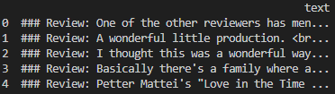

# Llama2 Fine-Tuning
- Llama2 Fine-Tuning Code with AutoTrain
- with Huggingface AutoTrain
- 출처 : [빵형의 개발도상국 - [코드 1줄] Llama 2 내 데이터로 파인튜닝 Colab에서](https://www.youtube.com/watch?v=GjZ1a0OJqGk)

## Settings
1. requirements setup
```
apt-get -y install libgl1-mesa-glx
apt-get -y install libglib2.0-0
pip install -r requirements.txt
```
2. Pytorch Update
```
autotrain setup --update-torch
```

## Example Run
- Datasets
    - koalpaca data : royboy0416/ko-alpaca | [Link](https://huggingface.co/datasets/royboy0416/ko-alpaca)
    
    - OpenAssistant data : timdettmers/openassistant-guanaco | [Link](https://huggingface.co/datasets/timdettmers/openassistant-guanaco)
    

- Training(AutoTrain Tuning) Setting
```
CUDA_VISIBLE_DEVICES=0 autotrain llm --train \
    --project_name "ko-llama2-finetune" \
    --model "TinyPixel/Llama-2-7B-bf16-sharded" \
    --data_path "royboy0416/ko-alpaca" \
    --text_column "text" \
    --use_peft \
    --use_int4 \
    --learning_rate 2e-4 \
    --train_batch_size 8 \
    --num_train_epochs 3 \
    --trainer sft \
    --model_max_length 2048
```

autotrain llm --train \
    --project_name "ko-llama2-finetune" \
    --model "meta-llama/Llama-2-13b-hf" \
    --data_path "royboy0416/ko-alpaca" \
    --text_column "text" \
    --use_peft \
    --use_int4 \
    --learning_rate 2e-4 \
    --train_batch_size 16 \
    --num_train_epochs 3 \
    --trainer sft \
    --model_max_length 2048

- test run
```
python test.py
```

## Test Result


# Custom Fine-Tuning
## IMDB Dataset Preprocessing
- Preprocessing IMDB.csv for Tuning
```
python data_preprocess.py
```
- Processing Result


## Run
- Training(AutoTrain Tuning) Setting
```
CUDA_VISIBLE_DEVICES=1 autotrain llm --train \
    --project_name "llama2-7b-imdb-finetuning" \
    --model "TinyPixel/Llama-2-7B-bf16-sharded" \
    --data_path . \
    --text_column "text" \
    --use_peft \
    --use_int4 \
    --learning_rate 2e-4 \
    --train_batch_size 8 \
    --num_train_epochs 3 \
    --trainer sft \
    --model_max_length 2100
```

- test run
```
python test.py
```